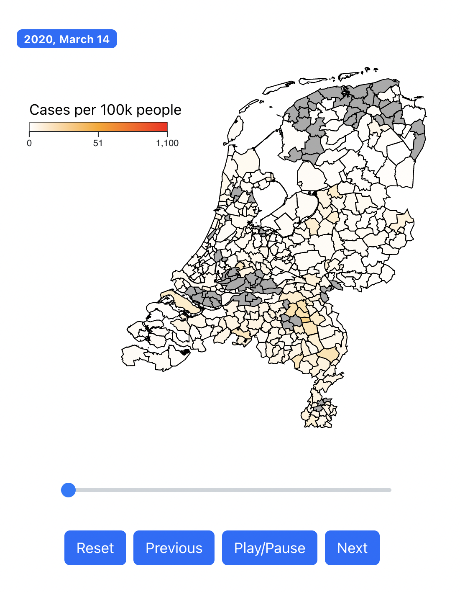
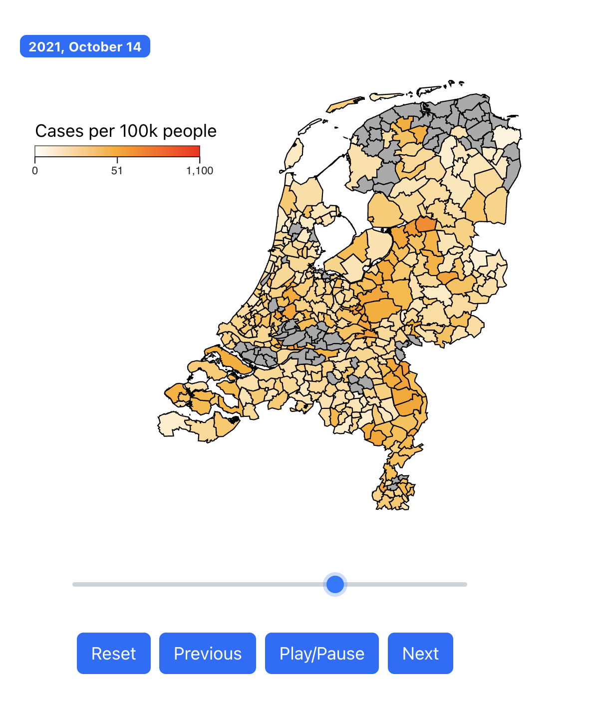

# Timelapse of COVID-19 data in the Netherlands

## Demo Link

Access my site at [covid-data-nl.netlify.app](https://covid-data-nl.netlify.app/).

## Table of Contents

- [About The App](#about-the-app)
- [Screenshots](#screenshots)
<!-- - [Technologies](#technologies) -->
- [Setup](#setup)
- [Approach](#approach)
- [Status](#status)
<!-- - [Credits](#credits) -->
- [License](#license)

## About The App

This app visualized COVID-19 data in the Netherlands, as published by the National Institute for Public Health and the Environment (Rijksinstituut voor Volksgezondheid en Milieu) or [RIVM](https://www.rivm.nl/).

I built this app as a fun exercise in teaching myself React.js and D3.js.

## Screenshots

## Setup

- Download or clone the repository
- Run `yarn install`
- Run `yarn start`
- Rest of the insturctions are described in the standard README that comes with the `start-react-app` template in [this file](README.old.md)

## Approach

- I've used the data as published by RIVM.
- Basic data cleaning operations are done.
- I've used (slightly old) population data per municipality to compute the case rate per day for each municipality. (v/s Absolute values published.)
- For smoothness of animation, it actually renders a 14-day moving average.

## Status

This app is being developed. In version 2.0 I am trying to bring the following changes

- Move class based components to functional ones.
- Better splitting.
- Zooming in & out in the map.
- Support to display other metrics, e.g. Hospitalization, and Mortality.

## License

MIT License.
